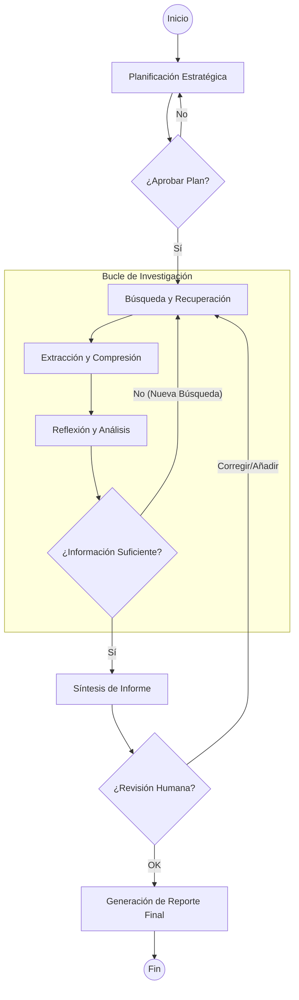
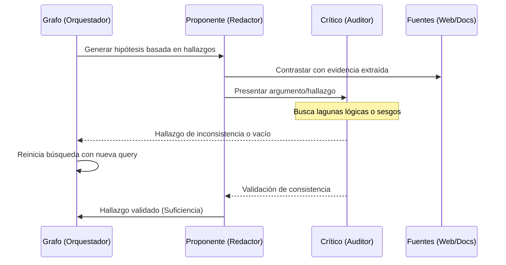

# 🧠 Deep Research Agent

Un sistema avanzado de agentes autónomos diseñado para ejecutar investigaciones profundas, análisis multidimensionales y generación de informes técnicos de alta fidelidad. A diferencia de los LLMs convencionales, este agente utiliza un paradigma de **orquestación basada en grafos** para navegar por la web, evaluar información, reflexionar sobre hallazgos y producir documentos finales estructurados.

## 🔄 Flujo de Trabajo (Arquitectura del Agente)

El proceso de investigación sigue un ciclo iterativo de pensamiento, acción y verificación, orquestado por un grafo de estados.

### 1. Diagrama de Flujo Principal (StateGraph)



### 2. Detalle de la Fase de Reflexión (Simulación Adversarial)

Durante la fase de reflexión, el agente no solo "lee", sino que simula un debate para asegurar la calidad.



---

## 🌟 Características Principales

- **Arquitectura Multi-Agente (LangGraph)**: Orquestación de nodos especializados (Planificación $\rightarrow$ Búsqueda $\rightarrow$ Extracción $\rightarrow$ Reflexión $\rightarrow$ Síntesis) con gestión de estado determinista.
- **Human-in-the-Loop (HITL)**: Interrupciones estratégicas para la validación humana en puntos críticos:
  - **Aprobación de Plan**: El usuario revisa la estrategia antes de iniciar la búsqueda.
  - **Revisión de Suficiencia**: El usuario valida si la información es suficiente o si requiere más iteraciones.
- **Persistencia y Resiliencia**: Gracias a los *checkpointers* de LangGraph, el agente puede reanudar investigaciones largas tras fallos de red o límites de API, manteniendo el hilo de la memoria.
- **Investigación Multisalto**: Capacidad de realizar búsquedas iterativas y reformular consultas para profundizar en temas complejos.
- **Búsqueda SearXNG con Pool Persistido y Respaldo Local**: Puede fijar un pool de 5 instancias públicas desde `searx.space`, reutilizarlo en búsquedas sucesivas, elegir una al azar por query y, si el pool público queda bloqueado, caer automáticamente a una instancia local de SearXNG dentro de Docker Compose.
- **Extracción HTML Mejorada**: Usa **Trafilatura** como primer intento para extraer contenido útil y conserva un *fallback* local basado en `HTMLParser` si la extracción avanzada falla.
- **Generación de Informes de Grado Profesional**: Producción automática de documentos en **Markdown**, **PDF** (vía WeasyPrint con plantillas Jinja2) y visualizaciones de datos (Matplotlib/Plotly).

---

## 🛠️ Stack Tecnológico

| Componente | Tecnología |
| :--- | :--- |
| **Orquestación** | [LangGraph](https://langchain-ai.github.io/langgraph/) |
| **Lenguaje** | Python 3.12+ |
| **Modelos (LLM)** | OpenAI, Ollama (Local) |
| **Búsqueda** | DuckDuckGo, SearXNG (pool público con fallback local en Compose), Tavily, Serper |
| **Extracción** | Trafilatura + fallback local con `HTMLParser` |
| **Base de Datos** | SQLite (Local), PostgreSQL (Producción) |
| **Web Interface** | FastAPI, Uvicorn, SSE (Server-Sent Events) |
| **Reporting** | Jinja2, WeasyPrint, python-pptx |

---

## ⚙️ Configuración y Variables de Entorno

El sistema utiliza `pydantic-settings` para gestionar la configuración. Es necesario crear un archivo `.env` en la raíz del proyecto basándose en `.env.example`.

### Variables Críticas

| Variable | Descripción | Ejemplo |
| :--- | :--- | :--- |
| `DEEP_RESEARCH_MODEL_PROVIDER` | Proveedor de LLM (`openai` u `ollama`) | `openai` |
| `DEEP_RESEARCH_OPENAI_API_KEY` | API Key de OpenAI (si aplica) | `sk-...` |
| `DEEP_RESEARCH_DEFAULT_SEARCH_PROVIDER` | Motor de búsqueda (`none`, `searxng`, `tavily`, `serper`) | `none` |
| `DEEP_RESEARCH_SEARXNG_REGISTRY_URL` | Registro público de instancias SearXNG | `https://searx.space/data/instances.json` |
| `DEEP_RESEARCH_SEARXNG_LOCAL_URL` | URL interna del fallback local de SearXNG dentro de Compose | `http://searxng:8080` |
| `DEEP_RESEARCH_SEARXNG_POOL_SIZE` | Cantidad de instancias a fijar en el pool persistido | `5` |
| `DEEP_RESEARCH_TAVILY_API_KEY` | API Key de Tavily (si aplica) | `tvly-...` |
| `DEEP_RESEARCH_SERPER_API_KEY` | API Key de Serper (si aplica) | `serper-...` |
| `DEEP_RESEARCH_POSTGRES_DB_URL` | URL de conexión a PostgreSQL | `postgresql://...` |
| `DEEP_RESEARCH_SQLITE_DB_URL` | URL de conexión SQLite local | `sqlite+aiosqlite:///./.local/deep_research.sqlite3` |
| `DEEP_RESEARCH_REPORT_OUTPUT_DIR` | Directorio donde se guardan los informes | `./reports` |

---

## 🚀 Guía de Ejecución

### 1. Desarrollo Local (Sin Docker)
Ideal para pruebas rápidas y desarrollo de lógica:

```bash
# Instalar dependencias de desarrollo
pip install -e ".[dev]"

# Ejecutar vía CLI
deep-research-agent run --query "El futuro de la computación cuántica en 2030"

# Ejecutar la Web App para monitoreo visual
deep-research-agent-web
```

### 2. Flujo de Trabajo con Docker (Producción/Integración)
Para entornos que requieren persistencia con PostgreSQL y una infraestructura completa, utiliza los scripts de automatización:

```bash
# 1. Preparar el entorno y levantar el stack base (Postgres + SearXNG local)
./scripts/compose-agent.sh bootstrap

# 2. Ejecutar una investigación dentro del contenedor
./scripts/compose-agent.sh run --query "Análisis de mercado de semiconductores"

# 3. Gestionar la investigación (aprobar/continuar)
./scripts/compose-agent.sh resume --thread-id <id> --decision approve

# 4. Detener todo el entorno
./scripts/compose-agent.sh down
```

### 3. Selección de SearXNG desde la UI

Si eliges `SearXNG Public Pool` en la pantalla de *Settings*, el servidor puede:

- fijar un pool persistido de 5 instancias públicas desde `searx.space`
- reutilizar ese pool en CLI y Web App mientras no se refresque manualmente
- elegir una instancia distinta al azar por búsqueda y hacer *fallback* al resto si una falla

Si todas las instancias públicas seleccionadas devuelven bloqueos de acceso o *rate limiting*, el backend usa automáticamente la instancia local `searxng` del stack de Docker Compose como respaldo para no interrumpir la investigación.

El botón `Refresh Pool` vuelve a seleccionar y persistir el pool sin necesidad de salir del flujo de Docker Compose.

---

## 🌐 Interfaz Web y Observabilidad

El proyecto incluye un servidor **FastAPI** que expone:
- **Dashboard de Investigación**: Visualización en tiempo real del progreso del agente mediante *Server-Sent Events* (SSE).
- **Gestión de Hilos**: Posibilidad de listar, resumir y reanudar investigaciones pendientes de forma visual.
- **Logs de Razonamiento**: Seguimiento de los pasos de pensamiento y las herramientas utilizadas por cada nodo del grafo.

---

## 🧩 Capacidades Especializadas (Skills)

El agente está diseñado para ser extensible mediante la integración de **Skills**. Estas permiten al agente:
- **Interactuar con Obsidian**: Leer, buscar y escribir notas en vaults locales.
- **Manipulación de JSON Canvas**: Crear mapas mentales y diagramas visuales de la investigación.
- **Diseño Web**: Auditar interfaces siguiendo guías de diseño profesional.
- **Análisis de Datos**: Utilizar herramientas de visualización para transformar hallazgos en gráficos técnicos.

---

## 🧪 Testing

Asegura la integridad del sistema ejecutando la suite de pruebas:

```bash
# Ejecutar todos los tests (pytest)
pytest

# Ejecutar tests de flujo de runtime específicos
pytest tests/test_runtime_flow.py -v
```

---

## 📁 Estructura de Directorios

- `src/deep_research_agent/` : Código fuente principal.
  - `runtime/` : Motor del grafo y lógica de ejecución.
  - `services/` : Implementaciones de LLM, búsqueda, extracción y reporte.
  - `web/` : Servidor web y lógica de la UI.
  - `domain/` : Modelos de estado y lógica de negocio.
- `tests/` : Suite de pruebas unitarias e integrales.
- `scripts/` : Utilidades para Docker y despliegue.
- `docs/` : Documentación técnica adicional.
