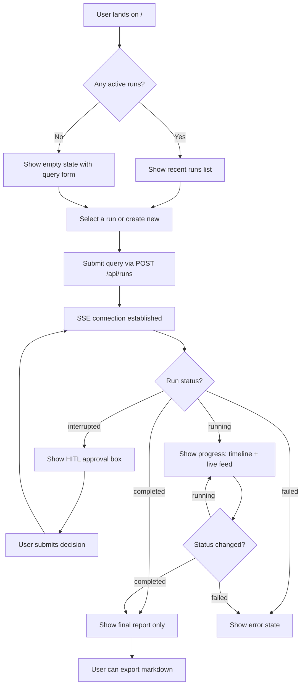

# Vue.js PWA Frontend Plan for Deep Research Agent

## Skills Applied

| Skill | Application |
|-------|-------------|
| `vue-best-practices` | Composition API + `<script setup lang="ts">`, Vue 3, Pinia, Vue Router, Vite |
| `frontend-design` | Bold editorial/magazine aesthetic, distinctive typography, warm research-paper palette |
| `frontend-ui-engineering` | Production-quality UI, accessibility (WCAG 2.1 AA), responsive design, proper state management |
| `vue-pinia-best-practices` | Pinia stores for research state and settings state management |

---

## Design Direction

**Aesthetic:** Editorial / Academic Journal meets modern dashboard
- **Tone:** Refined, scholarly, focused on content readability
- **Color Palette:** Warm paper tones with deep teal accents (inspired by academic journals)
- **Typography:** Display font for headings (distinctive serif), clean sans-serif for body, monospace for code/IDs
- **Key Differentiator:** The research report view feels like reading a beautifully typeset academic paper, while the progress view feels like a live research dashboard

---

## Architecture Overview

```
┌─────────────────────────────────────────────────────────────────┐
│                        Vue 3 PWA Frontend                       │
├─────────────────────────────────────────────────────────────────┤
│  ┌──────────────┐  ┌──────────────────────────────────────────┐ │
│  │   Router     │  │           App Shell Layout               │ │
│  │              │  │  ┌────────────┐  ┌─────────────────────┐ │ │
│  │ /            │──│──│  Sidebar   │──│    Main Content     │ │ │
│  │ /settings    │  │  │  Navigation│  │    (Views)          │ │ │
│  └──────────────┘  │  └────────────┘  └─────────────────────┘ │ │
│                    │                                          │ │
│                    │  ┌─────────────────────────────────────┐ │ │
│                    │  │         Pinia Stores                │ │ │
│                    │  │  - useResearchStore                 │ │ │
│                    │  │  - useSettingsStore                 │ │ │
│                    │  └─────────────────────────────────────┘ │ │
│                    └──────────────────────────────────────────┘ │
├─────────────────────────────────────────────────────────────────┤
│  API Service Layer (fetch/SSE) ──► FastAPI Backend (:8000)      │
└─────────────────────────────────────────────────────────────────┘
```

---

## Component Map

### Views (Route-level, thin composition surfaces)

| Component | Responsibility |
|-----------|---------------|
| `ResearchView.vue` | Composes query form, progress tracker, and final report. Orchestrates SSE connection. |
| `SettingsView.vue` | Composes provider configuration forms and execution parameter controls. |

### Shared Components

| Component | Props | Responsibility |
|-----------|-------|---------------|
| `StatusPill` | `status: RunStatus` | Displays colored status badge |
| `ProgressBar` | `current, max, label?: string` | Shows iteration/research progress |
| `MarkdownRenderer` | `content: string` | Renders markdown with syntax highlighting |
| `QueryForm` | `onSubmit: (query) => void` | Research query input with model selector |
| `TimelinePanel` | `notes: string[], status: RunStatus` | Collapsible timeline of research steps |
| `LiveFeedPanel` | `events: SseEvent[]` | Real-time LLM reasoning/preview feed |
| `ReportPanel` | `report: string, sections: ReportSection[]` | Final report display with export |
| `TasksPanel` | `tasks: PlanTask[]` | Research task list with status |
| `SourcesPanel` | `sources: SourceRecord[]` | Discovered sources list |
| `ApprovalBox` | `input: HumanReviewRequest, onSubmit: (decision) => void` | HITL decision interface |
| `ProviderCard` | `provider: string, config: ProviderConfig` | LLM provider configuration form |
| `SearchProviderSelector` | `value: string, onChange: (v) => void` | Search provider dropdown |
| `NumberInput` | `modelValue: number, label: string, ...` | Reusable number input field |
| `ApiKeyInput` | `modelValue: string, label: string` | Secure API key input |

### Composables

| Composable | Purpose |
|------------|---------|
| `useSseConnection(threadId)` | Manages SSE connection lifecycle, event handling |
| `useApi()` | Wrapper around fetch with error handling |
| `useMarkdown()` | Markdown rendering with caching |

---

## File Structure

```
deep-research-agent/frontend/
├── index.html
├── manifest.webmanifest          # PWA manifest
├── vite.config.ts
├── tsconfig.json
├── tsconfig.node.json
├── env.d.ts
├── package.json
├── pwa-icons/                    # PWA icons
│   ├── pwa-192x192.png
│   ├── pwa-512x512.png
│   ├── favicon.ico
│   ├── apple-touch-icon.png
│   └── masked-icon.svg
├── src/
│   ├── main.ts                   # App entry
│   ├── App.vue                   # Root component (thin)
│   ├── types.ts                  # API types
│   ├── router/
│   │   └── index.ts              # Vue Router config
│   ├── stores/
│   │   ├── useResearchStore.ts   # Research state + SSE
│   │   └── useSettingsStore.ts   # Settings state
│   ├── services/
│   │   └── api.ts                # API service layer
│   ├── composables/
│   │   ├── useSseConnection.ts   # SSE connection management
│   │   ├── useApi.ts             # API wrapper
│   │   └── useMarkdown.ts        # Markdown rendering
│   ├── views/
│   │   ├── ResearchView.vue      # Main research view
│   │   └── SettingsView.vue      # Settings/configuration view
│   ├── components/
│   │   ├── common/
│   │   │   ├── StatusPill.vue
│   │   │   ├── ProgressBar.vue
│   │   │   ├── MarkdownRenderer.vue
│   │   │   ├── NumberInput.vue
│   │   │   └── ApiKeyInput.vue
│   │   ├── research/
│   │   │   ├── QueryForm.vue
│   │   │   ├── TimelinePanel.vue
│   │   │   ├── LiveFeedPanel.vue
│   │   │   ├── ReportPanel.vue
│   │   │   ├── TasksPanel.vue
│   │   │   ├── SourcesPanel.vue
│   │   │   └── ApprovalBox.vue
│   │   └── settings/
│   │       ├── ProviderCard.vue
│   │       └── SearchProviderSelector.vue
│   └── styles/
│       ├── main.css              # Global styles, CSS variables
│       └── typography.css        # Font imports, type hierarchy
```

---

## State Management (Pinia)

### useResearchStore

```typescript
// State
interface ResearchState {
  activeThreadId: string | null
  isConnecting: boolean
  isConnected: boolean
  latestRun: ResearchRun | null
  runsList: RunListItem[]
  eventsByThread: Record<string, EventLogEntry[]>
  isResearchComplete: boolean  // derived from run status
}

// Key Actions
- connectToSse(threadId)     // Start SSE stream
- disconnectSse()            // Close SSE connection
- createRun(payload)         // POST /api/runs
- submitDecision(threadId, decision)  // POST /api/runs/:id/decisions
- fetchRuns()                // GET /api/runs
- fetchRun(threadId)         // GET /api/runs/:id
- fetchReport(threadId)      // GET /api/runs/:id/report.md

// Key Getters
- activeRun                  // Current run being viewed
- activeEvents               // Events for active thread
- activeRunStatus            // Computed status
- hasFinalReport             // true when status === completed && report exists
- isRunning                  // true when status === running
}
```

### useSettingsStore

```typescript
// State
interface SettingsState {
  settings: AgentSettings | null
  appConfig: AppConfig | null
  models: ModelInfo[]
  isSaving: boolean
}

// Key Actions
- fetchSettings()            // GET /api/settings
- saveSettings(data)         // POST /api/settings
- fetchConfig()              // GET /api/config
- fetchModels()              // GET /api/models
```

---

## Research View Flow



### Key UX Principle: Progress vs. Final State

- **During research:** Show timeline, live feed, tasks, sources, stats - everything is visible
- **After completion:** Hide all progress elements, show ONLY the final report in a clean, readable layout
- **Transition:** Smooth fade-out animation from progress view to report view

---

## Settings View

Single-page settings with sections:

1. **LLM Provider Configuration**
   - OpenAI/OpenAI-Compatible (API key, base URL)
   - Ollama (base URL)
   - Model selector (fetched from `/api/models`)

2. **Search Provider**
   - Dropdown: DuckDuckGo (free), Tavily, Serper
   - Conditional API key input for paid providers

3. **Execution Parameters**
   - Max iterations
   - Max sources per task
   - Total token budget
   - Max notes

---

## Docker Integration

### Updated Dockerfile (multi-stage build)

```dockerfile
# Stage 1: Build Vue frontend
FROM node:20-alpine AS frontend-build
WORKDIR /app/frontend
COPY frontend/package.json frontend/package-lock.json ./
RUN npm ci
COPY frontend/ ./
RUN npm run build

# Stage 2: Python backend
FROM python:3.12-slim
WORKDIR /app
COPY pyproject.toml research-context.md ./
COPY src ./src
RUN pip install --upgrade pip && pip install ".[postgres]"

# Copy built frontend
COPY --from=frontend-build /app/frontend/dist ./frontend/dist

RUN mkdir -p /app/.local

ENTRYPOINT ["deep-research-agent"]
CMD ["--help"]
```

### Updated docker-compose.yml

Add a nginx or use Python to serve static files:

```yaml
services:
  app:
    # ... existing config
    command: ["web", "--host", "0.0.0.0", "--port", "8000"]
```

The FastAPI backend will be updated to serve the Vue build from `/app/frontend/dist/` at the root path.

---

## CSS Design System

```css
:root {
  /* Color Palette - Academic Journal */
  --page: #f7f4ed;              /* Warm paper background */
  --surface: rgba(255, 253, 248, 0.95);
  --ink: #1a1814;               /* Deep warm black */
  --muted: #6b6358;
  --line: rgba(26, 24, 20, 0.08);
  
  /* Accent - Deep Teal */
  --accent: #0d7366;
  --accent-soft: rgba(13, 115, 102, 0.1);
  --accent-strong: #095c51;
  
  /* Semantic */
  --warm: #c27800;
  --warm-soft: rgba(194, 120, 0, 0.1);
  --danger: #c1121f;
  --danger-soft: rgba(193, 18, 31, 0.1);
  --success: #05844e;
  --success-soft: rgba(5, 132, 78, 0.1);
  
  /* Typography */
  --font-display: "Playfair Display", Georgia, serif;
  --font-body: "Source Sans 3", "Segoe UI", sans-serif;
  --font-mono: "JetBrains Mono", "Fira Code", monospace;
  
  /* Spacing Scale (0.25rem increments) */
  --space-1: 0.25rem;
  --space-2: 0.5rem;
  --space-3: 0.75rem;
  --space-4: 1rem;
  --space-6: 1.5rem;
  --space-8: 2rem;
  --space-12: 3rem;
  
  /* Radius */
  --radius-sm: 8px;
  --radius: 12px;
  --radius-lg: 20px;
  
  /* Shadows */
  --shadow-sm: 0 1px 3px rgba(26, 24, 20, 0.06);
  --shadow: 0 4px 12px rgba(26, 24, 20, 0.08);
  --shadow-lg: 0 12px 32px rgba(26, 24, 20, 0.12);
}
```

---

## API Endpoints Used

| Endpoint | Method | Purpose |
|----------|--------|---------|
| `/api/health` | GET | Health check |
| `/api/config` | GET | Default configuration |
| `/api/settings` | GET | Load settings |
| `/api/settings` | POST | Save settings |
| `/api/models` | GET | Fetch model catalog |
| `/api/runs` | GET | List runs |
| `/api/runs` | POST | Create new run |
| `/api/runs/:id` | GET | Get run details |
| `/api/runs/:id/report.md` | GET | Download report |
| `/api/runs/:id/events` | GET (SSE) | Stream events |
| `/api/runs/:id/decisions` | POST | Submit HITL decision |

---

## PWA Configuration

- **Display:** `standalone`
- **Theme Color:** `#0d7366` (deep teal)
- **Background Color:** `#f7f4ed` (warm paper)
- **Icons:** 192x192 and 512x512 PNG
- **Caching:** 
  - HTML/JS/CSS: CacheFirst with stale-while-revalidate
  - API routes: NetworkFirst
  - Fonts: CacheFirst with long TTL

---

## Responsive Breakpoints

| Breakpoint | Target | Layout Changes |
|------------|--------|---------------|
| 320px | Small mobile | Single column, collapsed sidebar |
| 768px | Tablet | Sidebar becomes top nav |
| 1024px | Desktop | Full two-column layout |
| 1440px | Large desktop | Max-width container, centered |

---

## Implementation Phases

### Phase 1: Foundation
- Update `vite.config.ts` with PWA plugin
- Create `manifest.webmanifest`
- Set up CSS design system
- Create types and API service layer
- Create Pinia stores

### Phase 2: Core Views
- Implement router
- Build App shell with navigation
- Implement Research View (query form, SSE connection)
- Implement Settings View

### Phase 3: Components
- Build shared components (StatusPill, ProgressBar, etc.)
- Build research components (Timeline, LiveFeed, Report, etc.)
- Build settings components

### Phase 4: Docker Integration
- Update Dockerfile for multi-stage build
- Update FastAPI to serve Vue build
- Update docker-compose.yml if needed

### Phase 5: Polish
- PWA icons and manifest
- Animations and transitions
- Accessibility audit
- Responsive testing
